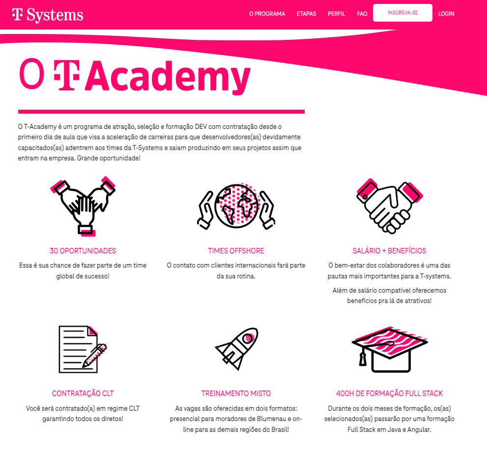

# T-System T-Academy

### O T-Academy é um programa de atração, seleção e formação DEV com contratação desde o primeiro dia de aula que visa a aceleração de carreiras para que desenvolvedores(as) devidamente capacitados(as) adentrem aos times da T-Systems e saiam produzindo em seus projetos assim que entram na empresa. Grande oportunidade!

|Capcacitações| MODALIDADE |Local| SITE |
|------|------|------|------|
|Java e Angular|Presencial/Remoto|Blumenau - SC / Brasil |
[▶️](https://t-systems.proway.com.br/)
|

---
[PÁGINA INICIAL](https://github.com/seiler-emerson/Programas_Capacitacao_Dev)