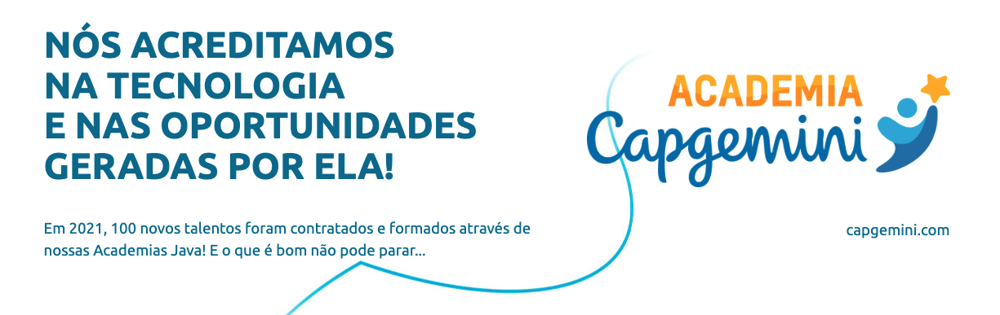

# Academia Java Capgemini

### É um Programa de Formação designado a capacitar futuros(as) colaboradore(as) para os times de trabalho da empresa.
### Formação Java de mais de 500 horas de treinamento, totalmente remunerada.

|Capcacitações| MODALIDADE |Local| SITE |
|------|------|------|------|
|Java, Angular e Node|EAD|BR|
[▶️](https://capgemini.proway.com.br/)
|

---
[PÁGINA INICIAL](https://github.com/seiler-emerson/Programas_Capacitacao_Dev)