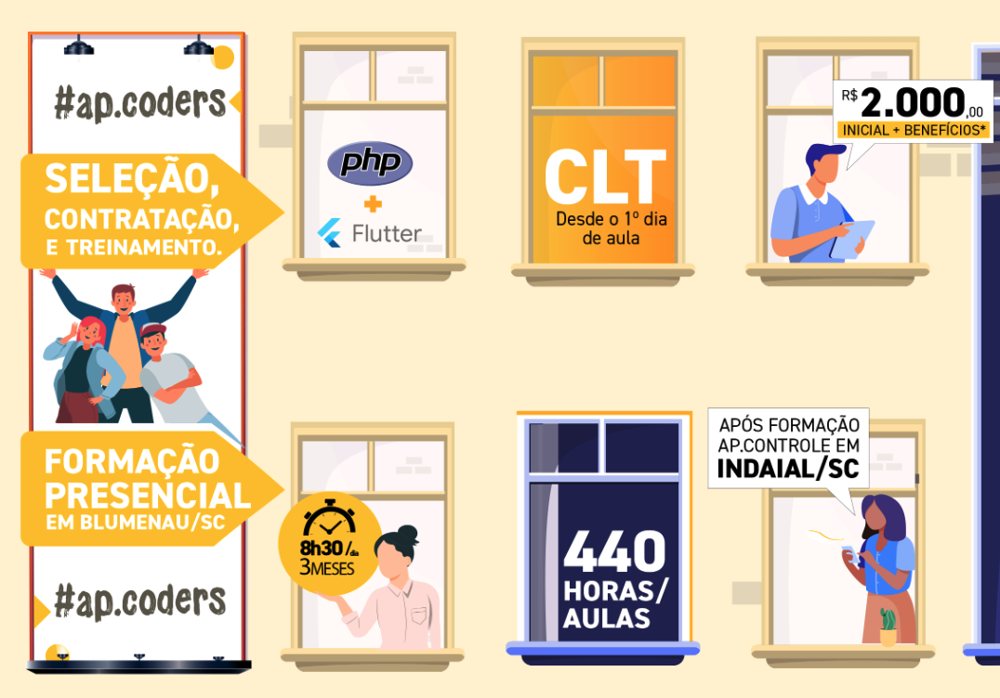

# Programa AP.CODERS

### AP Coders é o Programa de Atração, Seleção e Formação da AP Controle, que oferecerá aos selecionados uma formação de 440 horas em Front End e Back End PHP + DEV Mobile Flutter, com contratação desde o 1° dia de aula! A execução de todo o processo será realizada pela ProWay.

|Capcacitações| MODALIDADE |Local| SITE |
|------|------|------|------|
|Front End e Back End PHP, DEV Mobile Flutter|Presencial|Blumenau - SC|
[▶️](https://apcoders.com.br/)
|

---
[PÁGINA INICIAL](https://github.com/seiler-emerson/Programas_Capacitacao_Dev)