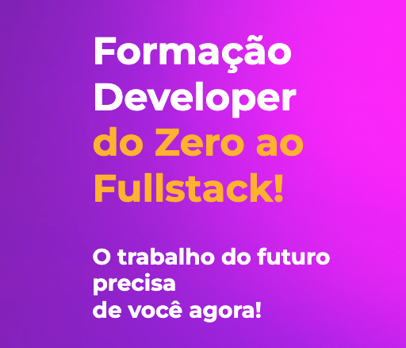

# Programa Dev TI SC

### O curso Formação de Desenvolvedores Para Tecnologia de Informação na Região Sul de Santa Catarina será dividido em três módulos:

- Módulo I: Introdução Básica ao Universo da Computação
- Módulo II: Competências para o Desenvolvedor Backend
- Módulo III: Formação prática em Desenvolvimento Web / Frontend.
    

|Capacitações| MODALIDADE |Local| SITE |
|------|------|------|------|
|Angular, React, Java|Presencial | Tubarão - SC|
[▶️](https://devtisul.com.br/)
|

---
[PÁGINA INICIAL](https://github.com/seiler-emerson/Programas_Capacitacao_Dev)