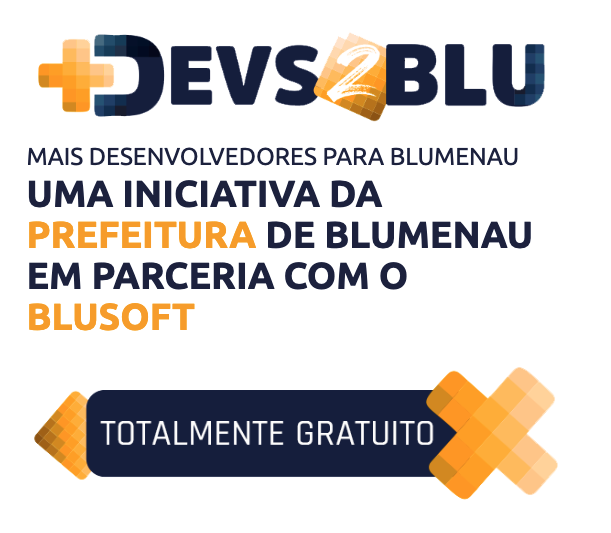

# +Devs2Blu

### O Programa +Devs2Blu é desenvolvido em Blumenau, um lugar de economia forte com milhares de empresas e diversas multinacionais de Tecnologia. Foi pensando nisso e nesse fortalecimento local e conjunto que nasce o +Devs2Blu: Um Programa Blumenauense de Capacitação DEV.
    

|Capcacitações| MODALIDADE |Local| SITE |
|------|------|------|------|
|Java, SQL, Rest, HTML, CSS, Spring, Node, Bootstrap , Angular, Inglês|Presencial|Blumenau - SC|
[▶️](https://www.devs2blu.com.br/)
|

---
[PÁGINA INICIAL](https://github.com/seiler-emerson/Programas_Capacitacao_Dev)