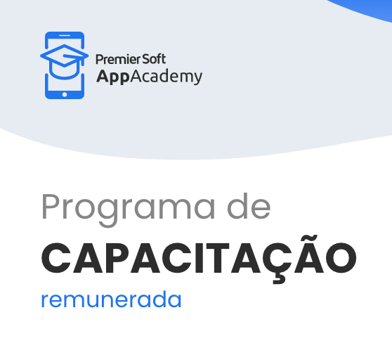

# Programa PremierSoft App Academy

### O AppAcademy tem como objetivo desenvolver e capacitar pessoas com o interesse de ingressar na área de TI.
### A fim de incentivar o desenvolvimento do setor em Blumenau e região, a iniciativa visa além de abrir as portas para aqueles que buscam novos desafios, suprir a alta demanda de profissionais capacitados.
### Nesta edição, o programa contemplará a área de Desenvolvimento iOS, API .NET e Qualidade de Software (QA).
    

|Capacitações| MODALIDADE |Local| SITE |
|------|------|------|------|
|iOS, API .NET, Qualidade de Software (QA)|Presencial/ Blumenau - SC|
[▶️](https://appacademy.premiersoft.net/)
|

---
[PÁGINA INICIAL](https://github.com/seiler-emerson/Programas_Capacitacao_Dev)