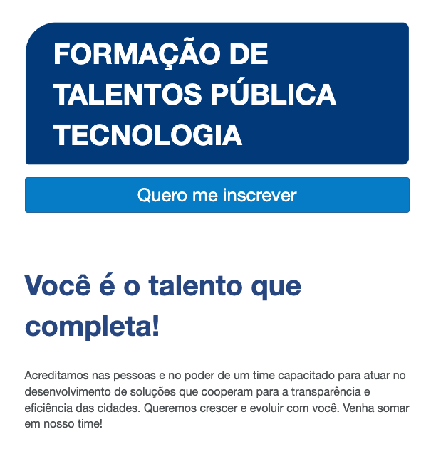

# Capacitação Pública Tecnologia

### É um Programa de Formação com 400h de capacitação gratuita em desenvolvimento Java, de segunda a sexta-feira, das 8h às 12h e das 13h30 às 18h. Com a execução da especialização pela ProWay e contratação CLT desde o primeiro dia de aula.

|Capcacitações| MODALIDADE |Local| SITE |
|------|------|------|------|
|Java|Presencial|Blumenau - SC|
[▶️](http://publica.proway.com.br/home/)
|

---
[PÁGINA INICIAL](https://github.com/seiler-emerson/Programas_Capacitacao_Dev)