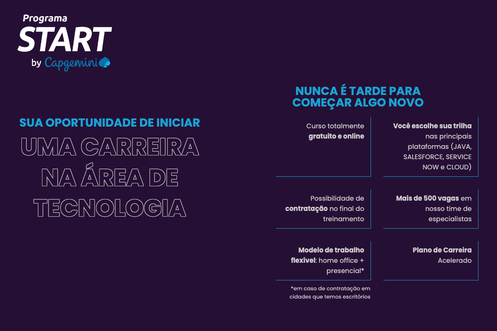

# Start Capgemini

### O Programa START da Capgemini foi criado para ajudar quem já é da área de TI ou quem deseja mudar de carreira, a ingressar no mercado e conquistar independência financeira para realizar seus sonhos, independentemente da sua idade.

|Capcacitações| MODALIDADE |Local| SITE |
|------|------|------|------|
|Java, Salesforce, Service Now e Cloud|EAD|BR|
[▶️](https://startcapgemini.com.br/)
|

---
[PÁGINA INICIAL](https://github.com/seiler-emerson/Programas_Capacitacao_Dev)